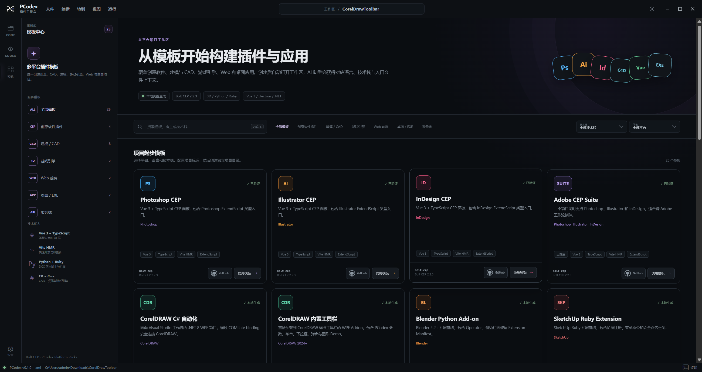
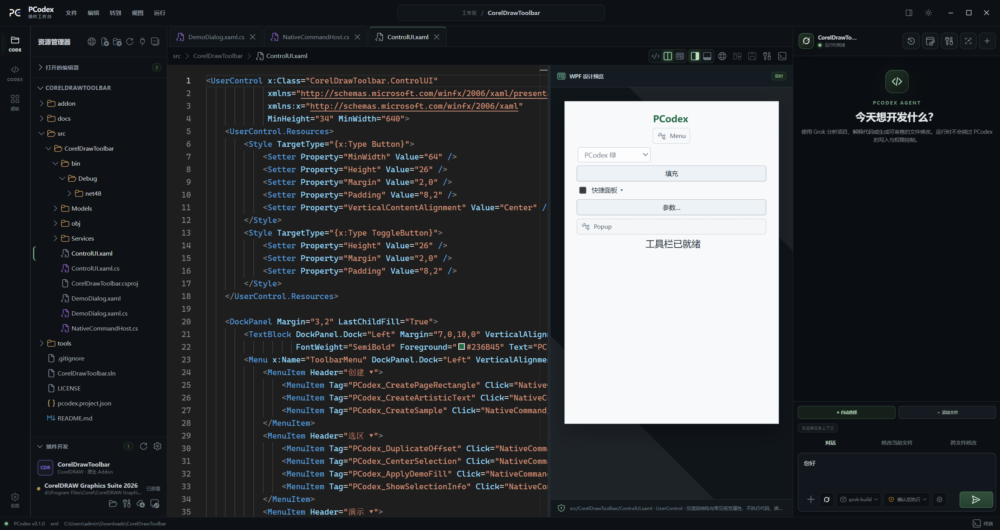
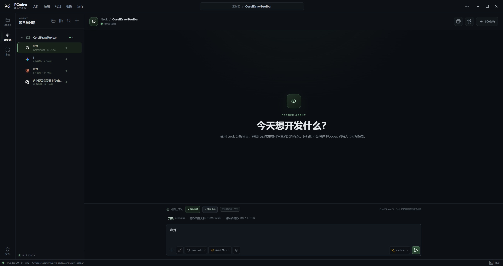

# PCodex Plugin Studio

### 面向插件、桌面与 Web 项目的专业 AI 开发工作台

从专业成品模板、环境检测和 AI 编程，到构建部署、一键启动宿主与插件调试，  
在一个桌面工作台里完成从创建项目到验证成品的完整开发闭环。

  
  
  
  

  
  

> [!IMPORTANT]
> 本仓库仅用于发布 **PCodex Plugin Studio 安装包、版本说明和问题反馈**，不包含项目源代码。请只通过本仓库的 [Releases](https://github.com/muchenkezhan/PCodex-Plugin-Studio/releases) 页面下载官方成品。

## 功能介绍

<table>
  <tr>
    <td width="50%" valign="top">
      <h3>原生多模型开发体验</h3>
      
为 Codex（GPT）、Claude、Gemini 与 Grok 提供独立 Runtime，保留各自的认证、模型选择、连续上下文和编程能力；同时支持 OpenAI Compatible Provider。

    </td>
    <td width="50%" valign="top">
      <h3>专业代码工作台</h3>
      
集成项目资源管理器、Monaco 多标签编辑器、终端和内置浏览器，减少在多个工具之间来回切换。

    </td>
  </tr>
  <tr>
    <td width="50%" valign="top">
      <h3>专业成品模板中心</h3>
      
内置面向主流宿主与技术栈的专业项目模板，预先准备工程结构、基础配置和开发任务，减少从空白项目搭建环境的重复工作，更快进入实际功能开发。

    </td>
    <td width="50%" valign="top">
      <h3>一键部署与宿主调试</h3>
      
按项目类型完成插件构建与宿主部署，并直接启动对应宿主软件进入调试；无需反复复制文件、切换工具和手动寻找插件目录。

    </td>
  </tr>
  <tr>
    <td width="50%" valign="top">
      <h3>可审查的 AI 修改</h3>
      
AI 生成的改动先进入差异预览，可逐文件批准、拒绝或取消；写入前仍需经过权限确认和磁盘基线检查。

    </td>
    <td width="50%" valign="top">
      <h3>开发环境检测</h3>
      
集中检查 Node.js、npm、Python、Go、.NET SDK、MSBuild、Visual Studio C++ 与平台 SDK，快速定位缺失依赖，并为构建、部署和调试做好准备。

    </td>
  </tr>
  <tr>
    <td width="50%" valign="top">
      <h3>Skills 专业能力扩展</h3>
      
支持按项目使用可复用的 Skills，将领域知识、工程规范和任务工作流带入 AI 编程过程。

    </td>
    <td width="50%" valign="top">
      <h3>MCP 工具与上下文接入</h3>
      
支持 Model Context Protocol（MCP），让 AI Runtime 接入外部工具、资源与服务，扩展可执行能力和项目上下文。

    </td>
  </tr>
</table>

## 软件界面

### 模板中心

按宿主软件、技术栈和项目类型选择专业成品模板，快速创建具备完整工程结构的项目。

  

### 代码工作台

在同一界面管理项目文件、编辑代码、运行终端任务并查看开发状态。

  

### Codex 原生工作区

通过独立 Codex Runtime 进行连续对话、项目分析与编程，并保留原生模型体验。

  

## 工作流

## 支持范围

| 分类 | 当前支持 |
| --- | --- |
| 原生 AI Runtime | Codex（GPT）、Claude、Gemini、Grok |
| 扩展模型接入 | OpenAI Compatible Provider |
| Skills | 可复用的领域知识、工程规范与任务工作流 |
| MCP | Model Context Protocol 工具、资源与服务接入 |
| Adobe | Photoshop、Illustrator、InDesign、Adobe Suite CEP |
| 设计与 CAD | CorelDRAW、AutoCAD、SketchUp |
| 三维内容 | Blender、Maya、3ds Max、Cinema 4D |
| 游戏引擎 | Unity、Unreal Engine |
| Web 项目 | Vue 3 + Vite、React + Vite |
| 桌面应用 | Electron、Wails、PySide6、Tkinter、.NET WPF |
| 服务端 | Express + TypeScript、Gin + Go |

## 核心体验

- **一个工作台完成开发**：文件、编辑器、AI、终端、浏览器和任务状态保持在同一上下文中。
- **专业模板快速起步**：从可直接开发的项目结构开始，省去重复配置工程、宿主适配和基础任务的时间。
- **一键完成宿主联调**：构建插件、部署到宿主目录并启动宿主软件，在同一工作台查看状态与输出。
- **模型能力原生保留**：Codex（GPT）、Claude、Gemini、Grok 使用各自独立 Runtime，不把专业编程体验压缩成普通 API 对话。
- **Skills 按项目复用**：为不同项目加载对应的领域知识、工程规范和任务工作流，让 AI 更贴合实际开发要求。
- **MCP 标准接入**：通过 Model Context Protocol 连接外部工具、资源与服务，扩展 AI Runtime 的上下文和执行能力。
- **AI 改动看得见**：所有文件修改先审查再应用，不直接静默覆盖项目内容。
- **按项目自动准备能力**：识别项目结构、工具链和宿主平台，提供对应任务与上下文。
- **多会话互不干扰**：不同项目和对话分别维护 Runtime、工作区和任务状态。
- **本机凭据安全保存**：模型密钥交由桌面主进程和系统安全存储管理，不写入工作区。
- **中文优先体验**：内置界面与默认 AI 交互面向简体中文工作流设计。

## 下载与安装

1. 打开 [Releases](https://github.com/muchenkezhan/PCodex-Plugin-Studio/releases/latest) 页面。
2. 下载最新的 `PCodex Plugin Studio-Setup-<版本号>.exe`。
3. 运行安装程序并选择安装位置。
4. 启动 PCodex，打开现有项目或从模板中心创建新项目。

> [!NOTE]
> 当前发布目标为 **Windows x64**。部分插件模板需要对应宿主软件、SDK 或开发工具链，PCodex 会在开发环境页面显示检测结果。

## AI 模型配置

PCodex 支持直接在应用内的 **供应商与认证** 中添加和管理自定义模型配置，也会读取本机 Claude Code、Codex 和 Gemini CLI 的现有配置文件。你也可以使用 [CC Switch](https://github.com/farion1231/cc-switch/releases) 统一添加、管理和切换模型供应商配置：

1. 从 CC Switch 的 Releases 页面下载并安装适合当前系统的版本。
2. 在 CC Switch 中分别完成 Claude、Codex 或 Gemini 的供应商配置。
3. 启动 PCodex 并选择对应的 AI Runtime，PCodex 会读取该工具已经写入本机的配置文件。

> [!TIP]
> CC Switch 默认管理 `~/.claude/`、`~/.codex/` 和 `~/.gemini/`。如果在 CC Switch 中修改了配置目录，请确保对应 CLI Runtime 使用相同目录。

## 安全设计

- AI 对项目文件的修改必须经过 Diff 审查和权限确认。
- 文件操作受当前工作区真实路径约束，拒绝路径逃逸和越界访问。
- API Key 不写入项目目录或浏览器本地存储。
- 托管任务使用预定义命令，不允许渲染层提交任意 Shell 命令。
- 普通 API 模型默认不具备终端、文件或其他隐式工具权限。

## 常见问题

  
<strong>这个仓库包含源代码吗？</strong>

   
  不包含。本仓库只用于分发正式安装包、发布版本说明和接收问题反馈。

  
<strong>在哪里下载最新版？</strong>

   
  请前往 <a href="https://github.com/muchenkezhan/PCodex-Plugin-Studio/releases/latest">Latest Release</a>，下载 Windows x64 安装程序。

  
<strong>使用 AI 功能需要自己配置模型吗？</strong>

   
  不同 Runtime 的认证方式不同。PCodex 为 Codex（GPT）、Claude、Gemini 和 Grok 提供独立配置与运行体验，并支持本机登录状态、受管配置和 OpenAI Compatible Provider；你可以直接在应用内的 <strong>供应商与认证</strong> 中添加和管理自定义配置。Claude、Codex 和 Gemini 配置也可以通过 <a href="https://github.com/farion1231/cc-switch/releases">CC Switch</a> 统一管理，PCodex 会读取对应 Runtime 已写入本机的配置文件。

  
<strong>遇到问题如何反馈？</strong>

   
  请在 <a href="https://github.com/muchenkezhan/PCodex-Plugin-Studio/issues">Issues</a> 中描述系统版本、PCodex 版本、复现步骤和错误信息。

## 团队成员

<table>
  <tr>
    <td align="center" width="20%">
      <a href="https://github.com/muchenkezhan">
         
        <strong>秋知德雨</strong>
      </a>
       
      项目负责人 · 产品架构
    </td>
    <td align="center" width="20%">
       
      <strong>一点优化</strong> 
      产品设计 · UI/UX
    </td>
    <td align="center" width="20%">
       
      <strong>长秋</strong> 
      AI Runtime · 模型接入
    </td>
    <td align="center" width="20%">
       
      <strong>天罩小山</strong> 
      插件平台 · 工具链
    </td>
    <td align="center" width="20%">
       
      <strong>红穆</strong> 
      质量保障 · 版本发布
    </td>
  </tr>
</table>

## 官方入口

| 用途 | 地址 |
| --- | --- |
| 项目主页 | [github.com/muchenkezhan/PCodex-Plugin-Studio](https://github.com/muchenkezhan/PCodex-Plugin-Studio) |
| 最新版本 | [Releases / Latest](https://github.com/muchenkezhan/PCodex-Plugin-Studio/releases/latest) |
| 问题反馈 | [GitHub Issues](https://github.com/muchenkezhan/PCodex-Plugin-Studio/issues) |

---

  <strong>PCodex Plugin Studio</strong> 
  Build with native AI runtimes. Deploy once. Debug in the host.  
  Copyright © 2026 PCodex. All rights reserved.

